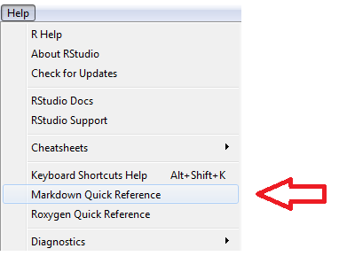
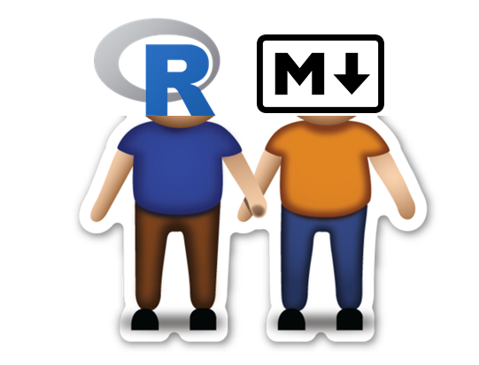
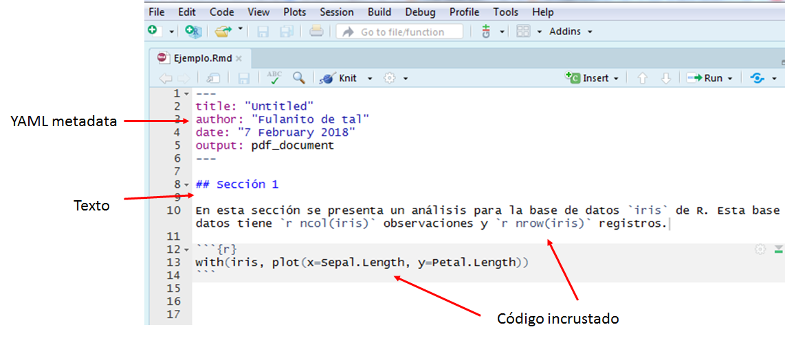
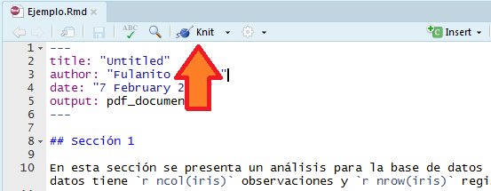
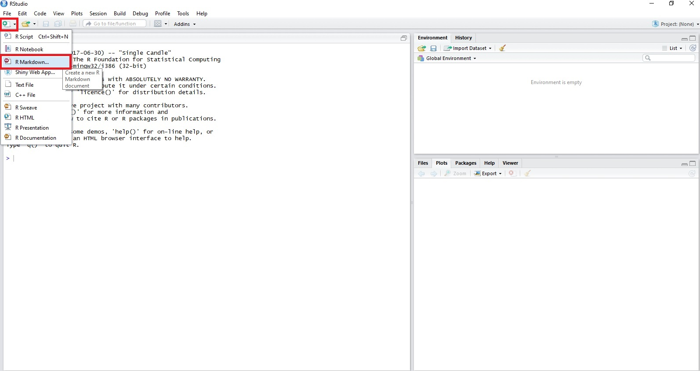
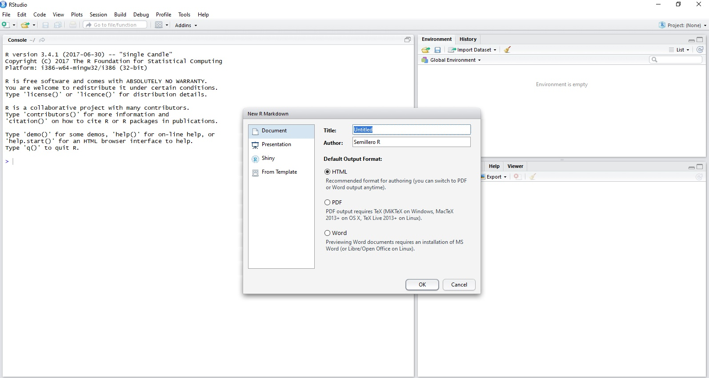
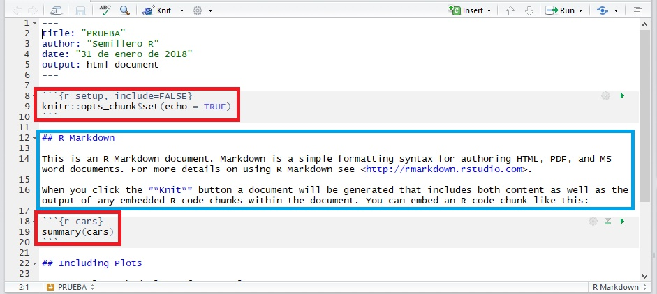
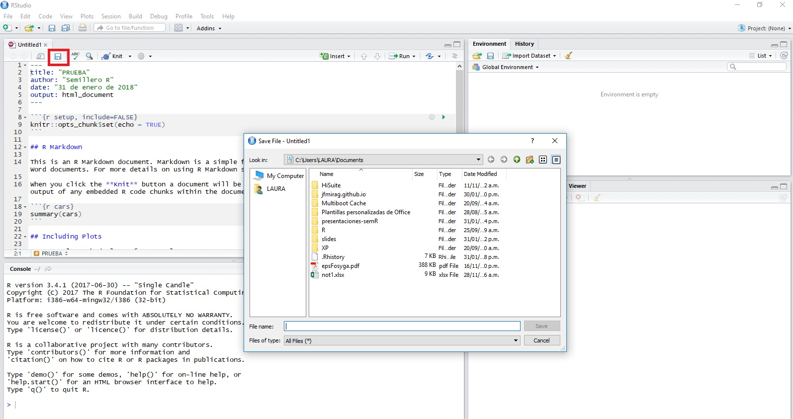
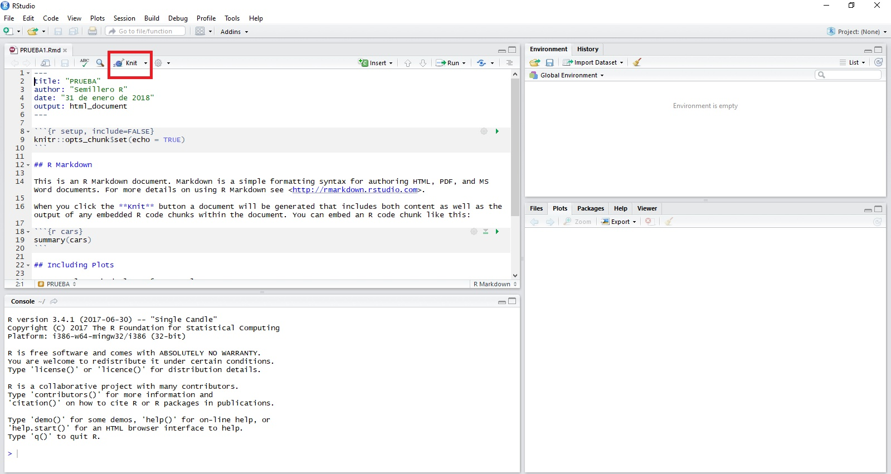

```{r setup, include=FALSE}
knitr::opts_chunk$set(echo = FALSE)
```
## ¿Qué es R?


## Lenguaje de programación R

R es un conjunto integrado de funciones para manejo de datos, cálculo y gráficos.

- Comandos para manejar y almacenar conjuntos de datos,
- Operadores para llevar a cabo cálculos con vectores y matrices
- Comandos para llevar a cabo diversos análisis de datos
- Comandos para gráficos,
- Un lenguaje de programación especialmente adaptado a cálculos estadísticos.

La aplicabilidad de R se puede extender mediante paquetes de funciones.

## ¿Que es Markdown?


## Markdown

Markdown es un lenguaje de marcado que facilita la aplicación de formato a un texto empleando una serie de caracteres. 


## ¿Pero qué es en realidad Markdown?


## Markdown Quick Reference




## ¿Qué es R Markdown?



## What is R Markdown? 


## ¿Qué se puede crear con R Markdown?


## Partes de un archivo .Rmd



## Se puede transformar un archivo R Markdown de dos maneras:

1. knit (tejer): puede tejer el archivo. El paquete rmarkdown llamará al paquete knitr. knitr ejecutará cada fragmento de código R en el documento y anexará los resultados del código al documento junto al fragmento de código. Este flujo de trabajo ahorra tiempo y facilita informes reproducibles.

2. convert (convertir): Puede convertir el archivo. El paquete rmarkdown usará el programa pandoc para transformar el archivo a un formato nuevo. Por ejemplo, puede convertir su archivo .Rmd en un archivo HTML, PDF o Microsoft Word. Incluso puede convertir el archivo en una presentación de diapositivas HTML5 o PDF. rmarkdown conservará el texto, los resultados del código y el formato contenidos en su archivo .Rmd original

## Botón knit




## Requerimientos

Se debe tener instalado los siguientes programas:

- R.
- RStudio.
- Instalar los paquetes `knitr` y `rmarkdown`.
- Saber markdown.
- MikTex (si se desea crear documentos en formato PDF)

## Instalación 

### R

https://cran.r-project.org/mirrors.html

### R studio

- https://www.rstudio.com/products/rstudio/download/

- install.packages("rmarkdown")

- install.packages("knitr")

###MikTex

https://miktex.org/download

## Como crear un documento de R Markdown (1)

1. En la pestaña señalada elegir R Markdown.



## Como crear un documento de R Markdown (2)

2. En la ventana que aparece llenar los datos, elegir el tipo de archivo y el formato deseado.



## Como crear un documento de R Markdown (3)

3. A continuación se resaltan de rojo las partes de código R y de azul las partes de texto.



## Como crear un documento de R Markdown (4)

4. Dar click en el lugar señalado para guardar el archivo, ponerle nombre y finalizar dando click en "Save"



## Como crear un documento de R Markdown (5)

Con el botón señalado comienza la construcción del archivo, también es posible cambiar el formato de salida dando click sobre la pestaña de este botón.




## Tutoriales

- https://www.youtube.com/watch?v=OrYLHgjuD3U
- https://www.youtube.com/watch?v=YXSp6VfZaUk

## Cibergrafia

http://rpubs.com/joser/introduccionR

http://blog.datatons.com/2016/04/08/que-es-lenguaje-programacion-r/

https://www.genbeta.com/guia-de-inicio/que-es-markdown-para-que-sirve-y-como-usarlo

https://rstudio-pubs-static.s3.amazonaws.com/169221_63fd9f5f6c71491fbbfe42ed298b3c31.html

http://rmarkdown.rstudio.com/articles_intro.html

## Hora de practicar
Replica en tu computador los dos ejemplos mostrados abajo, ingresa a los enlaces y descarga los archivos de ejemplo.

- [Ejemplo 1](https://github.com/srunal/talleres/blob/master/Taller%20intro%20R%20Markdown/Ejemplo1.docx)  

- [Ejemplo 2](https://github.com/srunal/talleres/blob/master/Taller%20intro%20R%20Markdown/Ejemplo2.docx)


