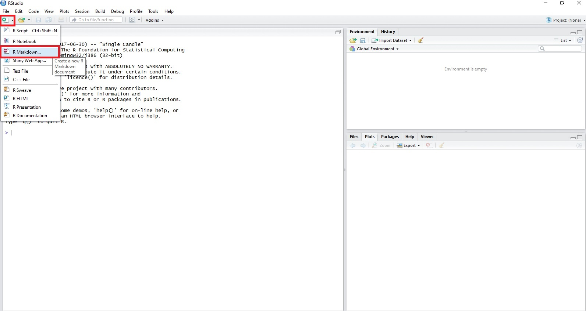
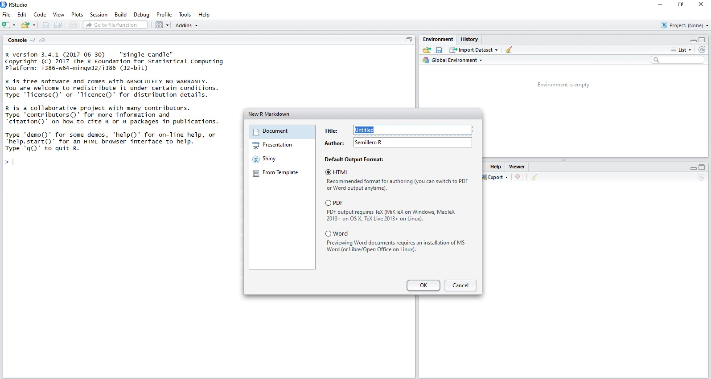
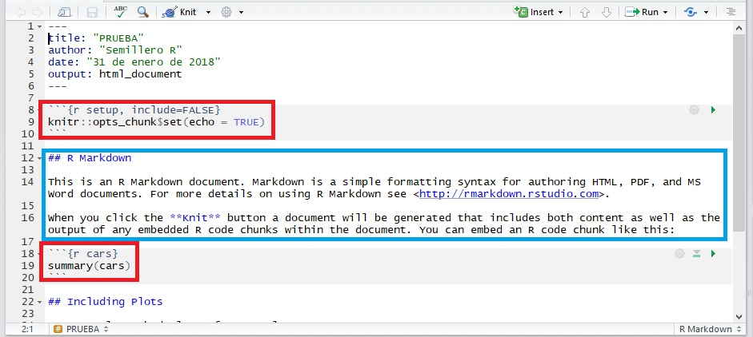
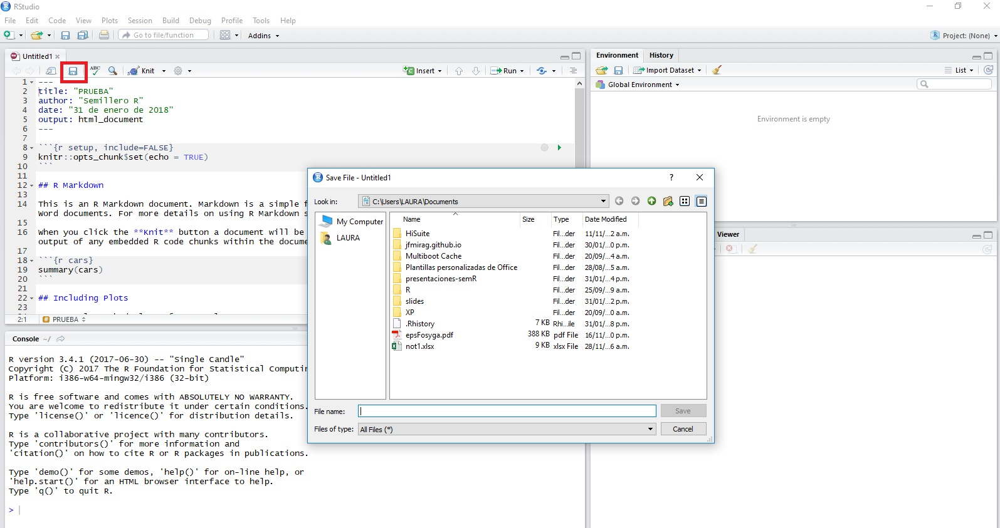
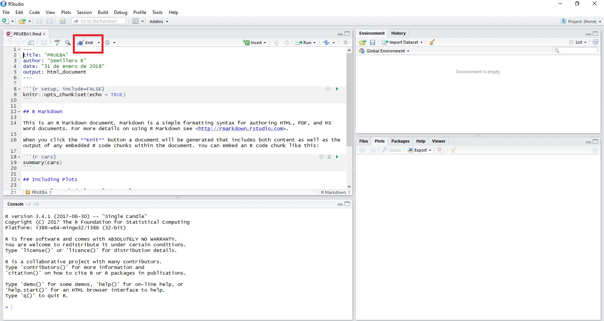
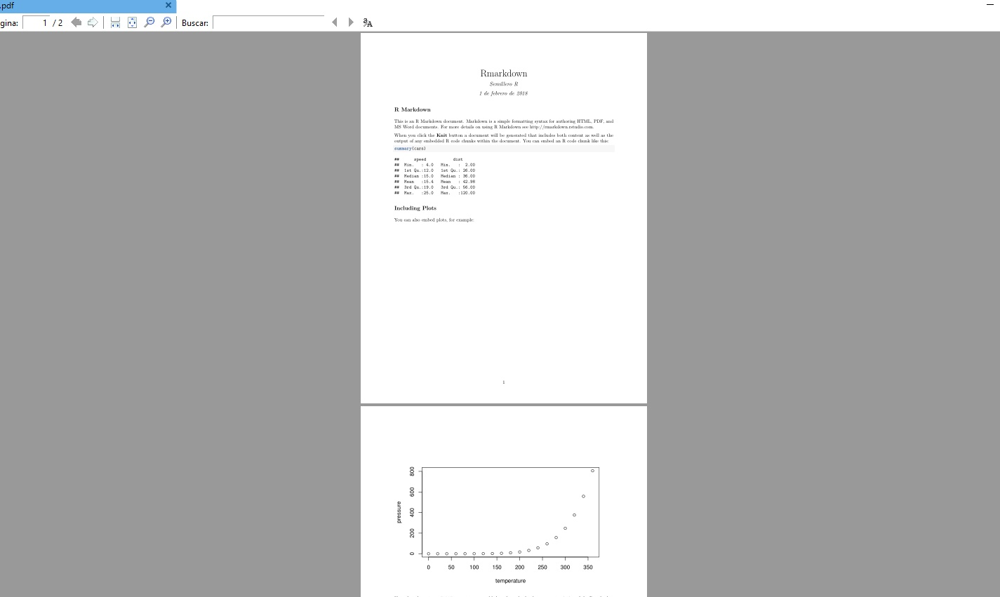

```{r setup, include=FALSE}
knitr::opts_chunk$set(echo = FALSE)
```
## ¿Qué es R?


## Lenguaje de programacion R

R es un conjunto integrado de funciones para manejo de datos, cálculo y gráficos.

- Comandos para manejar y almacenar conjuntos de datos
- Operadores para llevar a cabo cálculos con vectores y matrices
- Comandos para llevar a cabo diversos análisis de datos
- Comandos para gráficos
- Un lenguaje de programación especialmente adaptado a cálculos estadísticos

La aplicabilidad de R se puede extender mediante paquetes de funciones. La distribución básica contiene aproximadamente 25 paquetes.

## ¿Que es Markdown?


## Markdown

Markdown es un lenguaje de marcado que facilita la aplicación de formato a un texto empleando una serie de caracteres de una forma especial. En principio, fue pensado para elaborar textos cuyo destino iba a ser la web con más rapidez y sencillez que si estuviésemos empleando directamente HTML. Y si bien ese suele ser el mejor uso que podemos darle, también podemos emplearlo para cualquier tipo de texto, independientemente de cual vaya a ser su destino.

## ¿Qué es R Markdowk?


## R Markdowk (1)

R Markdown es un formato que permite una fácil creación de documentos, presentaciones dinámicas y informes de R. Markdown es un formato de sintaxis simple para crear documentos en HTML, PDF, y Word.

Video ¿que es R Markdown?:

https://www.youtube.com/watch?v=HqrRdRrmatk

## R Markdowk (2)

R Markdown admite docenas de formatos de salida estáticos y dinámicos, incluidos HTML, PDF, MS Word, Beamer, diapositivas HTML5, folletos al estilo Tufte, libros, paneles, aplicaciones brillantes, artículos científicos, sitios web y más.

## R Markdowk (3)

Un documento de R Markdown está escrito en markdown y contiene fragmentos de código R incrustado, como el documento a continuación.


## R Markdowk (4)

Se puede transformar un archivo R Markdown de dos maneras:

1. knit (tejer): puede tejer el archivo. El paquete rmarkdown llamará al paquete knitr. knitr ejecutará cada fragmento de código R en el documento y anexará los resultados del código al documento junto al fragmento de código. Este flujo de trabajo ahorra tiempo y facilita informes reproducibles.

2. convert (convertir): Puede convertir el archivo. El paquete rmarkdown usará el programa pandoc para transformar el archivo a un formato nuevo. Por ejemplo, puede convertir su archivo .Rmd en un archivo HTML, PDF o Microsoft Word. Incluso puede convertir el archivo en una presentación de diapositivas HTML5 o PDF. rmarkdown conservará el texto, los resultados del código y el formato contenidos en su archivo .Rmd original

## Requerimientos

Se debe tener instalado los siguientes programas:

- La versión más reciente de R.
- RStudio.
- Instalar el paquete knitr, rmarkdown.
- Conocimientos en markdown.
- MikTex (si se desea crear documentos en formato PDF)

## Instalación 

### R

https://cran.r-project.org/mirrors.html

### R studio

- https://www.rstudio.com/products/rstudio/download/

- install.packages("rmarkdown")

- install.packages("knitr")

###MikTex

https://miktex.org/download

## Como crear un documento de R Markdown (1)

1. En la pestaña señalada elegir R Markdown.



## Como crear un documento de R Markdown (2)

2. En la ventana que aparece llenar los datos, elegir el tipo de archivo y el formato deseado.



## Como crear un documento de R Markdown (3)

3. A continuación se resaltan de rojo las partes de código R y de azul las partes de texto.



## Como crear un documento de R Markdown (4)

4. Dar click en el lugar señalado para guardar el archivo, ponerle nombre y finalizar dando click en "Save"



## Como crear un documento de R Markdown (5)

Con el botón señalado comienza la construcción del archivo, también es posible cambiar el formato de salida dando click sobre la pestaña de este botón.



## Como crear un documento de R Markdown (6)



## Tutoriales

- https://www.youtube.com/watch?v=OrYLHgjuD3U
- https://www.youtube.com/watch?v=YXSp6VfZaUk


## Cibergrafia

http://rpubs.com/joser/introduccionR

http://blog.datatons.com/2016/04/08/que-es-lenguaje-programacion-r/

https://www.genbeta.com/guia-de-inicio/que-es-markdown-para-que-sirve-y-como-usarlo

https://rstudio-pubs-static.s3.amazonaws.com/169221_63fd9f5f6c71491fbbfe42ed298b3c31.html

http://rmarkdown.rstudio.com/articles_intro.html