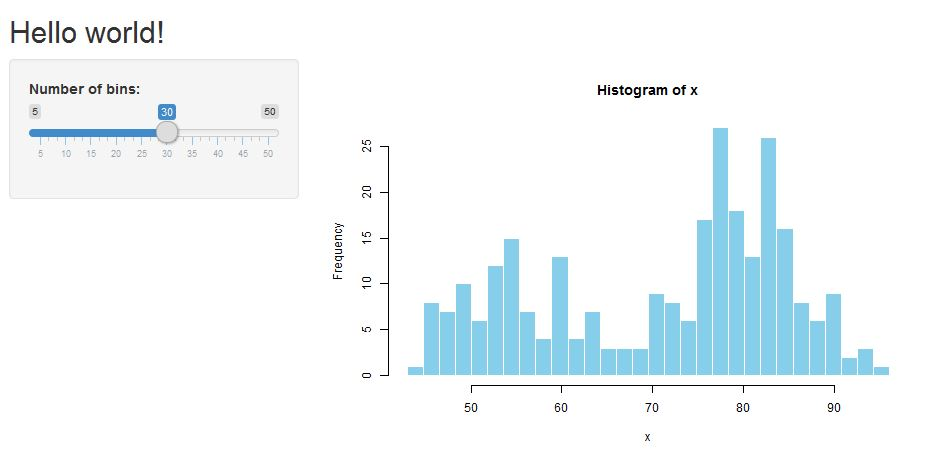
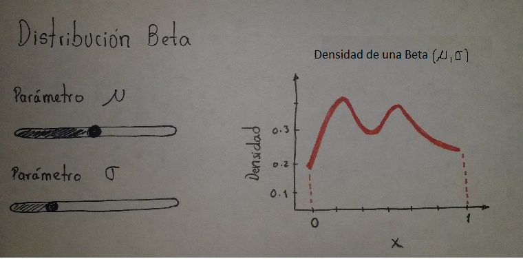

## Url de la presentación
- Para ver esta presentación visitar:

[https://rpubs.com/fhernanb/lesson1_shiny](https://rpubs.com/fhernanb/lesson1_shiny)


- La lección con más detalles puede ser encontrada en:

[http://shiny.rstudio.com/tutorial/lesson1/](http://shiny.rstudio.com/tutorial/lesson1/)

## Video de introducción
Para conocer lo que se puede hacer con las aplicaciones se recomienda ver este **[video](https://www.youtube.com/watch?v=c1sEvi_qrY4)**.

## ¿Que es Shiny?
- Shiny es un paquete de R.
- Permite crear de manera fácil aplicaciones web desde R. 
- Permite convertir código de R en html.
- Lo primero a hacer es instalar el paquete Shiny así:

```{r, eval=FALSE}
install.packages("shiny")
```

## Apps creadas por los miembros del Semillero

- Dmuestrales
- Poisson
- Binomial
- Binomial negativa
- Geometrica
- ZIP

## ¿Como ver las apps creadas por el Semillero?

Para interactuar con las apps hay dos formas:

1. Ejecutarlas desde [https://www.shinyapps.io](https://www.shinyapps.io)

2. Correrlas desde el repositorio de GitHub  [https://github.com/fhernanb/myapps](https://github.com/fhernanb/myapps)

## Desde shinyapps.io

Vamos a ejecutar la aplicacion llamada **Dmuestrales**, para esto usted debe copiar en la barra de direcciones de su navegador lo siguiente:

[https://fhernanb.shinyapps.io/Dmuestrales](https://fhernanb.shinyapps.io/Dmuestrales)

## Desde GitHub

Vamos a ejecutar la aplicacion llamada **Poisson**, para esto usted debe copiar en siguiente código en la consola de Rstudio:

```{r, echo=T, eval=F}
if (!require('shiny')) install.packages("shiny")
shiny::runGitHub(repo="myapps", username="fhernanb", subdir="Poisson")
```

## Ventajas de crear apps con Shiny

- Permite poner a disposición nuestro código en forma amigable.
- Permitir que usuarios sin conocimientos de R usen los procedimientos.
- Comunicar en forma didáctica ideas.
- Crear presentaciones con apps incrustadas.
- Divulgar conocimiento.
- $\ldots$

## Ejemplo
\centering


## Partes de una aplicación


## Archivos para crear una aplicación

1. ui.R: user interface file.

2. server.R: server file.

## ui.R
```{r, eval=FALSE}
library(shiny)
shinyUI(fluidPage(
  titlePanel("Hello Shiny!"),
  sidebarLayout(
    sidebarPanel(
      sliderInput(inputId = "bins",
                  label = "Number of bins:",
                  min = 1,
                  max = 50,
                  value = 30) ),
    mainPanel(    plotOutput("distPlot")   )
  )
))
```

## server.R

```{r, eval=FALSE}
library(shiny)
shinyServer(function(input, output) {
  output$distPlot <- renderPlot({
    x    <- faithful[, 2]  # Old Faithful Geyser data
    bins <- seq(min(x), max(x), length.out = input$bins + 1)
    hist(x, breaks = bins, col = 'darkgray', border = 'white')
  })
})
```

## ¿Cómo correr la app?


## Shiny card reference in this [link](http://shiny.rstudio.com/images/shiny-cheatsheet.pdf)


## Vamos a replicar la aplicación del ejemplo 1

Paso 1: Crear una carpeta para la aplicación.

Paso 2: Crear dos archivos vacíos en Rstudio con los nombres ui.R y server.R.

## continuación

Paso 3: Copiar el siguiente código en el archivo ui.R
```{r, eval=FALSE}
library(shiny)
shinyUI(fluidPage(
  titlePanel("Hello Shiny!"),
  sidebarLayout(
    sidebarPanel(
      sliderInput(inputId = "bins",
                  label = "Number of bins:",
                  min = 1,
                  max = 50,
                  value = 30) ),
    mainPanel(    plotOutput("distPlot")   )
  )
))
```

## continuación
Paso 4: Copiar el siguiente código en el archivo server.R
```{r, eval=FALSE}
library(shiny)
shinyServer(function(input, output) {
  output$distPlot <- renderPlot({
    x    <- faithful[, 2]  # Old Faithful Geyser data
    bins <- seq(min(x), max(x), length.out = input$bins + 1)
    hist(x, breaks = bins, col = 'darkgray', border = 'white')
  })
})
```

## continuación
Paso 5: Correr la aplicación


Nota: si usted no pudo transcribir correctamente los código ingrese a este enlace [http://shiny.rstudio.com/tutorial/lesson1/](http://shiny.rstudio.com/tutorial/lesson1/) para copiar los contenidos de ui.R y server.R.

## Pasos para crear una nueva aplicación

Paso 1. Crear un borrador de la aplicación.

Paso 2. Crear un archivo de prueba en R que haga lo que queremos con la App.

 `input <- NULL`
 
 `input$edad <- 56`
 
 `hist(bla bla bla)`
 
Paso 3. Crear los archivos ui.R y server.R.

Paso 4. Correr la aplicación.

## Su turno

Construir una aplicación que tenga una apariencia como la mostrada abajo. Use la función `dBE` del paquete **gamlss** en la cual el parámetro $\mu$ coincide con la media de la distribución.



## Detalles de la parametrización BE


## Felicitaciones, hiciste tu primera app


