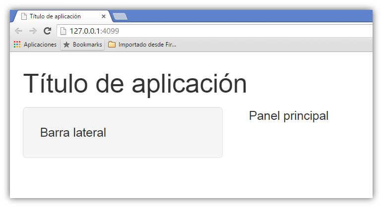
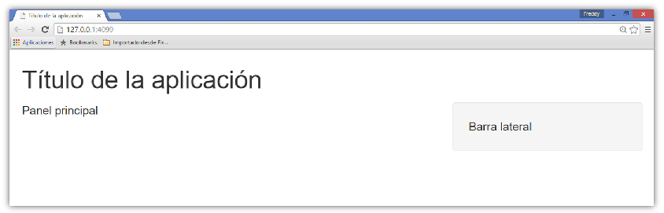
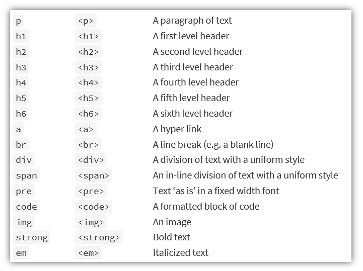
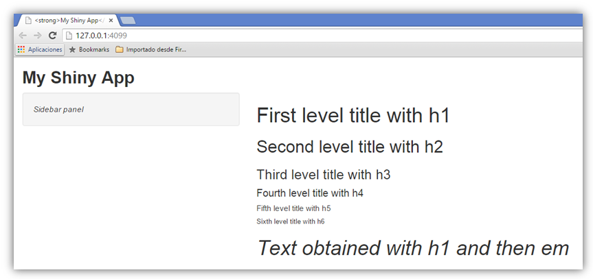
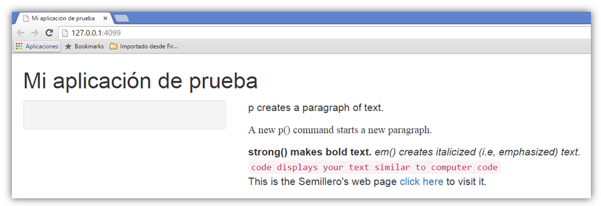

## Url de la presentación
Para ver la presentación visitar:

[https://rpubs.com/fhernanb/lesson2_shiny](https://rpubs.com/fhernanb/lesson2_shiny)

## ¿Qué aprendimos en la lección 1?
- Shiny es un paquete de R.
- Shiny permite convertir código de R en apps (html).
- Partes de una aplicación.
- Aprendimos para que sirven **ui.R** y **server.R**.
- Construimos la primera aplicación.

## Ejemplo de la mínima app

Es posible crear la **aplicación mínima** (que no hace nada) para experimentar con la estética. A continuación el contenido de los archivos ui.R y server.R:

**ui.R**
```{r, echo=T, eval=F}
library(shiny)
shinyUI(fluidPage(
))
```

**server.R**
```{r, echo=T, eval=F}
library(shiny)
shinyServer(function(input, output) {
})
```

## Su turno

<div class="red2">
Construya **usted mismo** la aplicación mínima.
</div>

**ui.R**
```{r, echo=T, eval=F}
library(shiny)
shinyUI(fluidPage(
))
```

**server.R**
```{r, echo=T, eval=F}
library(shiny)
shinyServer(function(input, output) {
})
```

## Resultado

<center></center>

## Su turno

Sustituya el archivo **ui.R** por lo siguiente:

**ui.R**
```{r, echo=T, eval=F}
library(shiny)
shinyUI(fluidPage(
  titlePanel("Titulo de aplicacion"),
  sidebarLayout(
  sidebarPanel("Barra lateral"),
  mainPanel("Panel principal")
  )
))

```

## Resultado

\centering


## Su turno

Sustituya el archivo **ui.R** por lo siguiente:

**ui.R**
```{r, echo=T, eval=F}
library(shiny)
shinyUI(fluidPage(
  titlePanel("Titulo de la aplicacion"),
  sidebarLayout(position = "right",
                sidebarPanel("Barra lateral"),
                mainPanel("Panel principal")
  )
))
```

## Resultado

\centering


## Contenido html

\centering



## Su turno
Sustituya el archivo **ui.R** por lo siguiente:
```{r, echo=T, eval=F}
shinyUI(fluidPage(
  titlePanel( strong("My Shiny App") ),
  sidebarLayout(
    sidebarPanel( em("Sidebar panel") ),
    mainPanel(
      h1("First level title with h1"),
      h2("Second level title with h2"),
      h3("Third level title with h3"),
      h4("Fourth level title with h4"),
      h5("Fifth level title with h5"),
      h6("Sixth level title with h6"),
      h1(em("Text obtained with h1 and then em"))
    )
  )
))
```

## Resultado



## Su turno
Sustituya el archivo **ui.R** por el código mostrado abajo. 

```{r echo=T, eval=F, mysize=TRUE, size='\\tiny'}
library(shiny)
shinyUI(fluidPage(
  titlePanel("Mi aplicacion de prueba"),
  sidebarLayout(
    sidebarPanel(),
    mainPanel(
      p("p creates a paragraph of text."),
      p("A new p() command starts a new paragraph.", 
        style = "font-family: 'times'; font-si16pt"),
      strong("strong() makes bold text."),
      em("em() creates italicized (i.e, emphasized) text."),
      br(),
      code("code displays your text similar to computer code"),
      p("This is web page", a(href="", "click here"), "to visit it.")
    ))
))
```

## Resultado




## ¿Cómo incluir una imagen en la app?

Se deben seguir los siguientes pasos:

1. Crear una carpeta con el nombre **www**.
2. La carpeta **www** debe estar en la misma carpeta donde están los archivos **ui.R** y **server.R**.
3. Guardar en la carpeta **www** la imagen a insertar.
4. Usar la función **img** para incluir la imagen.
5. Ejemplo: `img(src="logo_unal.png", height = 300, width = 520)`.


## Su turno
Sustituya el archivo **ui.R** por el código mostrado abajo. 

```{r echo=T, eval=F, mysize=TRUE, size='\\tiny'}
library(shiny)
shinyUI(fluidPage(
  titlePanel("My Shiny App"),
  sidebarLayout(
    sidebarPanel(
      img(src="http://goo.gl/pbajEu",height = 200, width = 320)
    ),
    mainPanel(
      img(src="http://goo.gl/w1VNsL", height = 300, width = 520)
    )
  )
))
```

## Resultado

\centering


## Su turno

<div class="green">
Construir una aplicación que tenga una apariencia como la mostrada a continuación con la distribución asignada.
</div>

## 
\centering


## Manos a la obra

<center> </center>

## Ayuda

A continuación usted podrá encontrar los enlaces a los archivos:

* Archivo [ui.R](https://github.com/fhernanb/semilleroApps/blob/master/ZAGA/ui.R)
* Archivo [server.R](https://github.com/fhernanb/semilleroApps/blob/master/ZAGA/server.R)

De click sobre el botón **raw** para acceder al código de los archivos.

## Actividad final

Enviar al correo semillerorunal@gmail.com los dos archivos ui y server con el asunto: distribución "la que fue asignada".

<center> </center>

## Lección con detalles

La lección con más detalles puede ser encontrada en:

[http://shiny.rstudio.com/tutorial/lesson2/](http://shiny.rstudio.com/tutorial/lesson2/)

# Muchas gracias